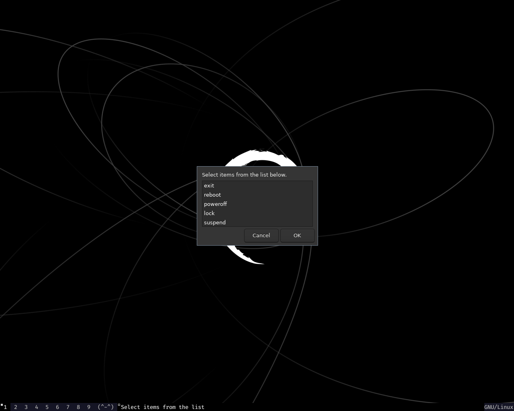

### Pretty basic configurations of dwm and st I use on my Debian Buster

### Screenshots




### Stuffs in this repository

1. Some handy dotfiles I use in my daily life

2. Dwm and St source directories

3. Wallpaper directory

4. Automated Installation script

### DWM directory include

**dwm-6.2 source code**

***Patche folder includes***

I've included some patches under `suckless/dwm-6.2/patches/` directory. Currently I've included only one patch pre-installed which is the `pertag` patch. This allows tilling layouts to be maintained as they separately across different tags.

**Customizations**

a. Move across screens with vim keys as well as arrow keys like in i3

b. Default mod key is set to super

c. Open terminal with MODKEY+Return

d. Default font is set to Fira Code Medium

e. Dmenu prompt with MODKEY+d

f. Close a window with MODKEY+q

h. On the status bar, tiling layout is denoted by `(^-^)`, floating layout is denoted by `(o.o)` and monocle layout is denoted by `{-.-}`. Thought this could be fun ^..^

i. The status bar is left to be completely untouched(aka default), because I like it that way -.-

j. Use MODKEY+F4 for seeing time as notification. Note that `libnotify-bin` needs to be pre-installed if you're building your system up from a minimal installation.

k. See cpu core temp with MODKEY+F3.

l. If you're using pulseaudio, you can increase volume with F9, and decrease with F8, and toggle mute with F10.

m. Take a screenshot with scrot by pressing the Print key

n. Terminal file manager is set to be nnn(Noice is Not Noice), and can be launched using MODKEY+g. The default terminal is set to st(simple terminal)

o. Launch a floating terminal using MOD2KEY+Return. MOD2KEY is set to alt, so Alt+Return.

p. If you're using mocp music player, launch it with MOD2KEY+p.

q. Exit prompt is ran with zenity prompt. To exit, press MODKEY+Shift+e

r. Launch Firefox-esr with MODKEY+w. This will run Firefox in floating mode in 3rd tag.

s. Font family is set to Fira Code Medium

t. MODKEY+Ctrl+Return make selected window to move to prominent window(master window)

u. Hover over a window and scroll to move focus to that screen since focus follows mouse is turned off. To turn on Focus follows mouse, uncomment line #168 and #254 that says enternotify.

### st directory includes

**st-0.8.4**

**Patch folder includes**

Patches folder include 3 patches, one for proper transparency(alpha patch), and rest of the two patches for scrolling. Scroll patches are pre-patched and you don't have to manually patch it ^.^

**Customizations**

a. Colorscheme is a darker version of nord(background color being black).

b. Font family is set to Fira Code Medium

c. Page up with Shift+PageUp, Page down with Shift+PageDown(default keys included with scroll patches)


### Shell scripts

The shell script directory includes scripts ready to be placed in `/usr/local/bin` as root. These shell scripts are necessary for little stuffs like viewing time, temperature, for zenity exit prompt, for volume up and down. As root, place these scripts in `/usr/local/bin` and chmod them to 755.


### Setting everything up.

For dwm and st to compile and install successfully, you'll need libraries pre-installed. Install them with;

```sh
apt install libx11-dev libxft-dev libxinerama-dev
```
Also notice that the default font is set to be Fira Code Medium, You'll also need to install FiraCode font family with;

```sh
apt install fonts-firacode
```

When that's done, just `cd` into dwm or st as root and run `make` and `make install`

### Automated installation

The automated installation script will install all the prerequisites along with some additional packages. Of course you'll have the freedom to choose which packages you'll be needing (^-^)

***Godspeed...***

Feel free to support at [bitcoin] 13erq7DDXDuqqBohht3UNyuJCXtpJcWGSe
